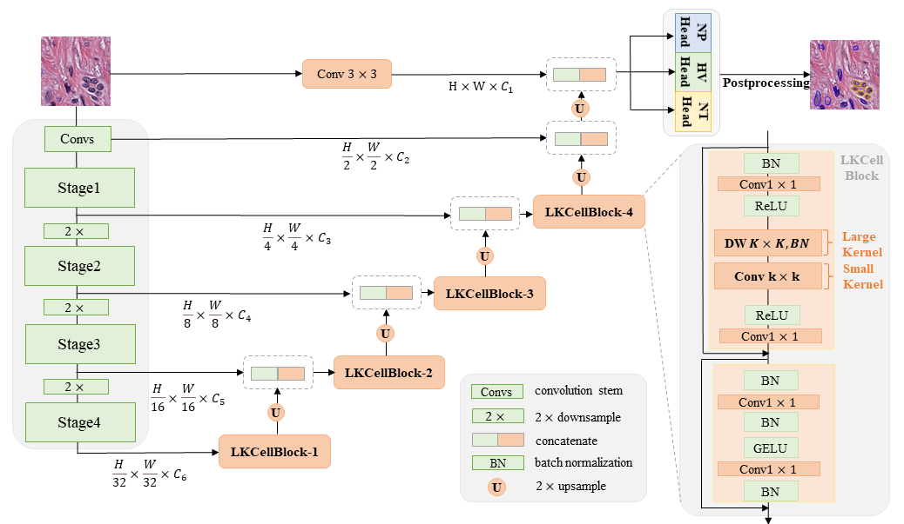

<div align="center">
<h1> LKCell🔬</h1>
<h2> Efficient Cell Nuclei Instance Segmentation with Large Convolution Kernels </h2>


[](https://arxiv.org/abs/2407.18054)
[](https://www.python.org/downloads/release/python-360/)
[](https://github.com/hustvl)
[](https://huggingface.co/spaces/xiazhi/LKCell)


[Ziwei Cui]([https://github.com/ziwei-cui]) <sup>1*</sup>, [Jingfeng Yao](https://github.com/JingfengYao) <sup>1*</sup>, [Lunbin Zeng]([https://github.com/xiazhi1]) <sup>1</sup>, [Juan Yang]() <sup>2</sup>, [Wenyu Liu](http://eic.hust.edu.cn/professor/liuwenyu) <sup>1</sup>, [Xinggang Wang](https://xwcv.github.io/) <sup>1,📧</sup>

<sup>1</sup> School of Electronic Information and Communications, Huazhong University of Science and Technology \
<sup>2</sup> Department of Cardiology, Huanggang Central Hospital

(\* equal contribution, 📧 corresponding author) 

[Key Features](#key-features) • [Installation](#installation) • [Usage](#usage) • [Training](#training) • [Inference](#inference)  • [Citation](#Citation)


---
<div align="left">

  
## Key Features

**Click and try LKCell on our [🤗 Hugging Face Space](https://huggingface.co/spaces/xiazhi/LKCell)!**

This repository contains the code implementation of LKCell, a deep learning-based method for automated instance segmentation of cell nuclei in digitized tissue samples. LKCell utilizes an architecture based on large convolutional kernels and achieves state-of-the-art performance on the [PanNuke](https://warwick.ac.uk/fac/cross_fac/tia/data/pannuke) dataset, a challenging nuclei instance segmentation benchmark. 


<p align="center">
  
</p>


## Installation

```
git clone https://github.com/hustvl/LKCell.git
conda create -n lkcell
conda activate lkcell
pip install -r requirements.txt
```

Note: (1) preferred torch version is 2.0; (2) If you find problem in installing `depthwise-conv2d-implicit-gemm==0.0.0` , please follow the instruction in [here](https://github.com/AILab-CVC/UniRepLKNet).

<!-- 1. Clone the repository:
  `git clone https://github.com/ziwei-cui/LKCellv1.git`
2. Create a conda environment with Python 3.10 version and install conda requirements: `conda  create -n your_environment`. 
3. Activate environment: `conda activate lkcell_env`
4. Install torch (>=2.0) for your system, as described [here](https://pytorch.org/get-started/locally/). Preferred version is 2.0, see [optional_dependencies](./optional_dependencies.txt) for help. You can find all version here: https://pytorch.org/get-started/previous-versions/

5. Install optional dependencies `pip install -r requirements.txt`.
6. If you find problem in installing `depthwise-conv2d-implicit-gemm==0.0.0` , please follow the instruction in [here](https://github.com/AILab-CVC/UniRepLKNet) -->


## Project Structure

We are currently using the following folder structure:

```bash
├── base_ml               # Basic Machine Learning Code: Trainer, Experiment, ...
├── cell_segmentation     # Cell Segmentation training and inference files
│   ├── datasets          # Datasets (PyTorch)
│   ├── experiments       # Specific Experiment Code for different experiments
│   ├── inference         # Inference code for experiment statistics and plots
│   ├── trainer           # Trainer functions to train networks
│   ├── utils             # Utils code
│   └── run_cellvit.py    # Run file to start an experiment
├── config                # Python configuration file for global Python settings            
├── docs                  # Documentation files (in addition to this main README.md
├── models                # Machine Learning Models (PyTorch implementations)
│   └── segmentation      # LKCell Code
├── datamodel             # Code of dataclass :Graph Data , WSI object , ...
├── preprocessing         # Code of preprocesssing : Encoding , Patch Extraction , ...
```


## Training

### Dataset preparation
We use a customized dataset structure for the PanNuke and the MoNuSeg dataset.
The dataset structures are explained in [pannuke.md](docs/readmes/pannuke.md) and [monuseg.md](docs/readmes/monuseg.md) documentation files.
We also provide preparation scripts in the [`cell_segmentation/datasets/`](cell_segmentation/datasets/) folder.

### Training script
The CLI for a ML-experiment to train the LKCell-Network is as follows (here the [```run_cellvit.py```](cell_segmentation/run_cellvit.py) script is used):
```bash
usage: run_cellvit.py [-h] --config CONFIG [--gpu GPU] [--sweep | --agent AGENT | --checkpoint CHECKPOINT]
Start an experiment with given configuration file.

python ./cell_segmentation/run_cellvit.py  --config ./config.yaml
```

The important file is the configuration file, in which all paths are set, the model configuration is given and the hyperparameters or sweeps are defined.


**Pre-trained UnirepLKNet models** for training initialization can be downloaded from Google Drive: [UnirepLKNet-Models](https://drive.google.com/drive/folders/1pqjCBZIv4WwEsE5raUPz5AUM7I-UPtMJ).


### Evaluation
In our paper, we did not (!) use early stopping, but rather train all models for 100 to eliminate selection bias but have the largest possible database for training. Therefore, evaluation neeeds to be performed with the `latest_checkpoint.pth` model and not the best early stopping model.
We provide to script to create evaluation results: [`inference_cellvit_experiment.py`](cell_segmentation/inference/inference_cellvit_experiment.py) for PanNuke and [`inference_cellvit_monuseg.py`](cell_segmentation/inference/inference_cellvit_monuseg.py) for MoNuSeg.

### Inference

Model checkpoints can be downloaded here:

- [LKCell-L](https://drive.google.com/drive/folders/1r4vCwcyHgLtMJkr2rhFLox6SDldB2p7F?usp=drive_link) 🚀
- [LKCell-B](https://drive.google.com/drive/folders/1i7SrHloSsGZSbesDZ9hBxbOG4RnaPhQU?usp=drive_link)

You can click [🤗 Hugging Face Space](https://huggingface.co/spaces/xiazhi/LKCell) to quickly perform model inference.


## Citation
```latex
@misc{cui2024lkcellefficientcellnuclei,
      title={LKCell: Efficient Cell Nuclei Instance Segmentation with Large Convolution Kernels}, 
      author={Ziwei Cui and Jingfeng Yao and Lunbin Zeng and Juan Yang and Wenyu Liu and Xinggang Wang},
      year={2024},
      eprint={2407.18054},
      archivePrefix={arXiv},
      primaryClass={eess.IV},
      url={https://arxiv.org/abs/2407.18054}, 
}
```
